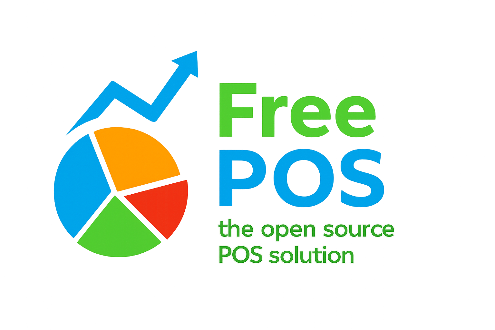

# FreePOS - Open Source Point Of Sale

## An intuitive & modern web based POS system for retail businesses

FreePOS uses the power of the modern web to provide an easy to use & extensible POS system, now powered by **Laravel 12**.

It supports standard POS hardware including receipt printers, cashdraws and barcode scanners. Runs on any device with a web browser.

With a rich administration dashboard and reporting features, FreePOS brings benefits to managers and staff alike.

Take your business into the cloud with FreePOS!

## ⚡ Built with Laravel

FreePOS has been reimplemented using the Laravel framework, providing:
- Modern PHP architecture
- Eloquent ORM for database operations
- Laravel's powerful routing and middleware
- Better security and authentication
- Improved maintainability and scalability

## 🚀 Quick Start

1. Configure your web server to serve from the `public/` directory
2. Copy `.env.example` to `.env` and configure your environment
3. Run migrations: `php artisan migrate`
4. Access different applications:
   - API: `/api/*`
   - Main POS: `/pos`
   - Admin: `/admin`


## Server Prerequisites

FreePOS requires:

1. **PHP 8.0+** with the following extensions:
   - cURL
   - GD
   - PDO
   - Mbstring
   - OpenSSL
   - Tokenizer
   - XML
   - JSON

2. **Composer** for dependency management

3. **MySQL/MariaDB** or other Laravel-supported database

4. **Node.js** (optional, for real-time features with socket.io)

## Installation & Startup

1. Clone the latest FreePOS release to your installation directory

2. Install PHP dependencies:
   ```bash
   composer install
   ```

3. Copy and configure environment:
   ```bash
   cp .env.example .env
   php artisan key:generate
   ```

4. Configure your database in `.env` file

5. Run database migrations:
   ```bash
   php artisan migrate
   ```

6. Visit `/install` in your browser & follow the installation wizard

7. Login to the admin dashboard at `/admin`

## Laravel Commands

```bash
# Run development server
php artisan serve

# Run migrations
php artisan migrate

# Clear cache
php artisan cache:clear
php artisan config:clear

# Run tests
php artisan test
```

## Technology Stack

- **Framework**: Laravel 12
- **Database**: MySQL/MariaDB with Eloquent ORM
- **Authentication**: Laravel Sanctum
- **Frontend**: Vue.js (preserved from original)
- **Real-time**: Socket.io / Pusher / Ably (optional)

## Legacy Compatibility

While the backend has been reimplemented in Laravel, the frontend applications and APIs maintain backward compatibility with the original FreePOS structure.
